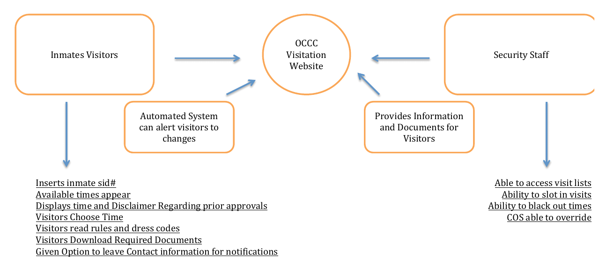

# Kipa Requirements

## Goals

The Kipa system is intended to make the following interrelated improvements to the current OCCC visitation process:

  1. *Increase communication bandwidth*.  Communication by prospective visitors to OCCC is currently by a single phone line, which is often busy or not staffed.  This creates frustration for OCCC staff and visitors. Kipa improves communication by augmenting the phone line with web-based and text message-based communication.  Prospective visitors can request visits and find out the status of their request via the web. Prospective visitors will also receive text messages reminding them of visit reservations, dress code, documentation, and so forth. If OCCC staff need to cancel visits, they can use Kipa to generate text messages to all affected visitors. 
   
  2. *Decrease procedural breakdowns.* OCCC visitation is subject to strict procedures, and deviations from these procedures can result in long waits to become a visitor, missed visits, or revocation of visitation privileges. Kipa attempts to reduce the number of procedural breakdowns by providing web and text message based information to visitors that inform them of the procedures they need to follow to become an authorized visitor, to successfully visit a detainee, and to avoid travel time to OCCC when staffing shortages or other issues result in cancellation of their visit.
   
  3. *Decrease OCCC staff overhead.* The current infrastructure for OCCC visitation (phone line plus spreadsheet) makes management of the visitation process time-consuming for OCCC staff. We hope that the introduction of Kipa will reduce the overhead for staff by providing visitors and OCCC with a web-based and text message-based method for communicating visit requests and reservations. 
  
  4. *Decrease visitor, detainee, and OCCC staff frustration levels.* If successful, Kipa will reduce the frustration currently experienced by visitors (because they will be able to successfully visit more easily), detainees (who will get more visits from less frustrated visitors) and OCCC staff (who will spend less time on visitation with a higher percentage of successful visits).
  
## Basic architecture

Kipa is a web application with two user interfaces: one for visitors and one for OCCC staff, as illustrated in the following diagram:

  
## Visitor states

Kipa classifies a visitor as being in exactly one of the following "states".  Kipa's web interface displays different information to a visitor and enables different actions depending upon their state.

*NeverAuthorized:* A visitor is in this state if they have not yet turned in their documentation and had it approved by OCCC staff. A NeverAuthorized visitor cannot login to the Kipa site, but can click a button labeled "Learn about visitation" on the home page to obtain instructions on how to submit documentation to become authorized.

Once a visitor is authorized by OCCC staff, they can login to the Kipa site using their 10 digit phone number as a username and a 4 digit PIN (password) provided to them via text message or over the OCCC phone line. (Later versions of Kipa may offer alternative login approaches, but the initial version will require visitors to provide a 10 digit phone number accepting text messages in order to use Kipa.) The following states apply to visitors who have submitted documentation and had it approved.

*RequestVisit:* This state is associated with visitors who do not have a scheduled visit and are not blocked. When they login, Kipa shows a page which allows them to request a visit. If they have already requested a visit but it has not yet been scheduled by OCCC staff, then this page indicates what they have requested and allows them to change it.

*PendingVisit:* This state is associated with visitors for whom OCCC staff have approved an upcoming visit. When they login, Kipa shows a page with the date and time of the upcoming visit and reminders about dress code and documentation. The visitor can cancel the scheduled visit from this page if desired.

*Blocked:* A visitor enters this state if their documentation requires updates, or if they have been barred from visitation for some other reason. When they login, Kipa displays information about why they are currently blocked and what they have to do to become eligible to request visits again.
  
## Use Cases

The following pages document a series of "use cases", which are end-to-end interactions with Kipa that illustrate the most common scenarios of use.  Kipa has two interfaces: one used by visitors, and one used by OCCC staff.  However, the overall workflow involves a third party (the detainee), and so some of the use cases specify the detainee even though they do not interact directly with the system.
 
  * [(Detainee) Submit visitor list](usecase-detainee-submit-visitor-list.md)
  * [(Visitor) Obtain initial authorization](usecase-visitor-obtain-initial-authorization.md) 
  * [(Staff) Authorize visitor](usecase-staff-authorize-visitor.md)
  * [(Visitor) Request visit](usecase-visitor-request-visit.md)
  * [(Staff) Schedule visit](usecase-staff-schedule-visit.md)
  * [(Visitor) Pending visit](usecase-visitor-pending-visit.md)
  * [(Staff) Block visitor](usecase-staff-block-visitor.md)
  * [(Visitor) Blocked status](usecase-visitor-blocked-status.md)
  * [(Detainee) Update visitor list](usecase-detainee-update-visitor-list.md)

## Resources

These requirements are based upon the [HACC OCCC Family Visitation resources](https://github.com/HACC2016/HACC-Challenge-Information/tree/master/OCCC-Family-Visitation-Scheduling). 
  
  
  
